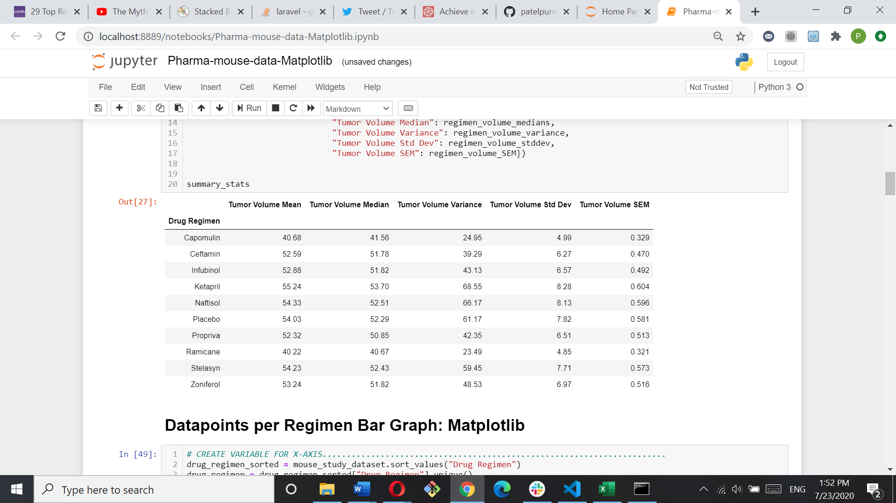
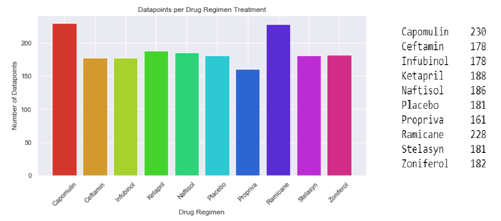
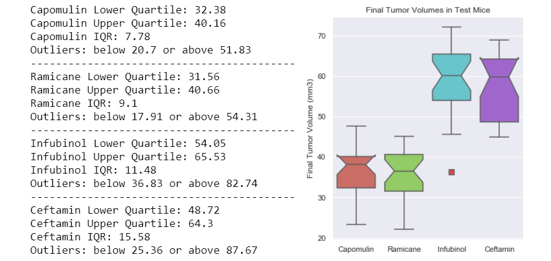
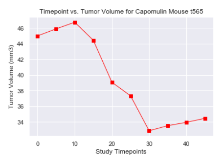
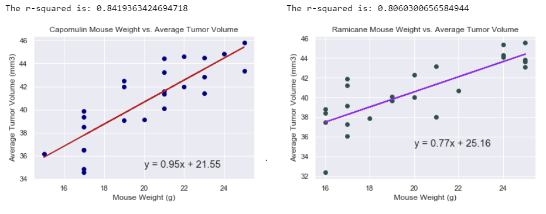

# Pharmaceutical clinical mouse trial

## Background
This project uses sample (fake) data from an anti-cancer pharmaceutical clinical trial to explore data analysis through Pandas, and graph generation through both `matplotlib.plot()` and `pandas.DataFrame.plot()`. The data reflects clinical drug trials in mice aimed at screening for potential treatments for squamous cell carcinoma (SCC), a commonly occurring form of skin cancer. 

In this study, 250 mice identified with SCC tumor growth were treated through a variety of drug regimens. Tumor development was observed and measured over the course of 45 days. The purpose of the study was to compare the performance of a "drug of interest" - Capomulin - versus nine other potential treatment regimens. Source data was drawn from 2 datasets: metadata on each mouse used in the trials (`Mouse_metadata.csv`) and results of the study that tracked tumor growth rates over the 45-day period (`Study_results.csv`).

Data analysis was done with jupyter notebooks, with summary graphs produced using the Matplotlib and Pandas libraries for Python.
* the `Pharma-mouse-data-Matplotlib.ipynb` notebook houses the initial analysis, which includes some additional data on gender of the mice in the study, as well as initial versions of the same graphs plotted in both Matplotlib and Pandas. 
* the `Pharma-mouse-data-FINAL.ipynb` notebook contains the final analysis summarized below, as well as cleaned up versions of the relevant graphs in --either-- Matplotlib --OR-- Pandas (but not both).

-----
## General Observations
1. Capomulin and Ramicane both had the lowest overall average tumor volumes across all datapoints, as well as relatively low variance, standard deviation, and SEM - suggesting that the results for those two regimens were more positive and more consistent than the other regimens studied.

2. Capomulin and Ramicane had the greatest number of mice complete the study, while all other regimens observed a number of mouse deaths across the duration of the study.

3. Looking at the tumor growth in one of the Capomulin mice (Mouse t565), the results show that Capomulin did inhibit tumor growth for that particular mouse, but only to a certain point (in this case, between time points 10 and 30). After that, the effectiveness of the drug seems to plateau tumor growth starts to increase again, even with the regimen.

4. Looking at the data for the Capomulin and Ramicane mice, there is a positive correlation between each mouse's weight and the volume of the tumor, meaning the larger the mouse, the larger the tumor. This indicates that mouse weight may be contributing to the effectiveness of any drug regimen, however this trend was less pronounced with Ramicane than with Capomulin.

-----
## Detailed Analysis

### 1. Summary Table: Tumor Volume (mm3)

The summary data show that Capomulin had among the best results in terms of the mice on the drug showing the lowest tumor growth rates (both in mean and median tumor volume), as well as the most consistent results across test subjects, evidenced by lower values for variance, standard deviation, and SEM. The only other comparable drug regimen, with even slightly better values, was Ramicane. 

It may be useful to note that Capomulin and Ramicane also had the highest numbers of datapoints per drug regimen.  This could mean that outliers potentially had less effect on overall results (and on the summary statistics) than for regimens with fewer data points. On the other hand, this also means that the subjects for Capomulin and Ramicane lived longer, thus allowing collection of more data points. 

### 2. Promising regimens & Analysis of Outliers

Four regimens (Capomulin, Ramicane, Infubinol, and Ceftamin) were chosen for more detailed analysis. Looking at the final tumor values for each mouse in each regimen, box plots were generated for each regimen.  The results show that one sample for Infubinol was an outlier, but the other three regimens had no outliers in the data. 

Based on the IQRs, if there are any outliers in the data, they were most likely to be in the Infubinol or Ceftamin data groups. Ceftamin had the widest IQR, with Infubinol being the second highest. However, this could be the result of a wider variance in the datapoints, instead of there being an outlier skewing the data. Looking back at the Summary Data table created for volume growth, Infubinol had the widest variance between the 4 regimens being compared, with Ceftamn coming in second. Additionally, Infubinol also had the widest standard deviation of the four.

While the presence of outliers is easy enough to check for with the quartile and IQR analysis, I usually prefer to simple graph the data as boxplots, to visually confirm outliers.  A look at the boxplots shows that it is in fact Infubinal that had an outlier within its dataset. We can also see that the final tumor volumes for Capomulin and Ramiance were noticeably lower overall, indicating better effectiveness of these drugs. 

### 3. Specific sample data

#### Capomulin Mouse t565
To see the effect of the drug on tumor growth over time, I found it useful to map out the datapoints for one particular mouse in the Capomulin cohort.  Mouse t565 was chosen because it did survive the entire study, but was also average in results for survivors, meaning that it showed neither among the best nor among the worst results for the surviving Capomulin cohort.  You can see from the plot that, at first, the tumor continued to grow and so it took at least 2 doses of the drug before noticeable decreases in tumor growth were recorded (after day 10).  The tumor growth was at its lowest point on day 30, but after that the tumor growth began to increase despite addition doses of the drug. 

#### Linear Regression: Capomulin & Ramicane Mouse Weight vs. Tumor Volume
For our two best performing drugs, there was one final analysis comparing the weight of each mouse to the average tumor volume (i.e. averaging all tumor measurements during the trial) for that mouse.  I used linear regression to illustrate the correlations more clearly. While there is a clear correlation between weight and average tumor volume for mice in both groups, indicating that mouse weight may be contributing to the effectiveness of the drug regimen, the correlation was less pronounced with the Ramicane mice.  

